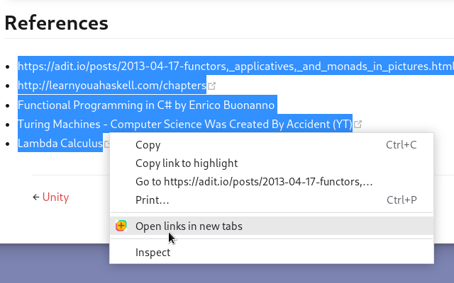

# Open Multiple Links

[link-chrome]: https://chrome.google.com/webstore/detail/open-multiple-links/aihgofmdijjhegajmdomlafeiklofndl 'Chrome Web Store'
[link-edge]: https://microsoftedge.microsoft.com/addons/detail/open-multiple-links/edibnioojbnicoocokdokbmgblbnnbpe 'Edge Addons'

[][link-chrome]
[][link-edge]

A web browser extension that makes it easy to open many links from web pages.
Just select/highlight some text containing links, right-click it, and select
"Open links in new tabs".

